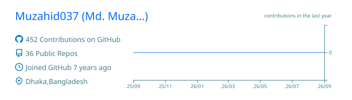
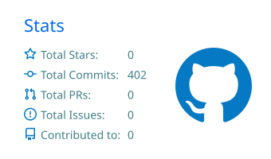
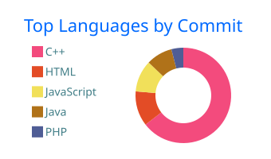

<h1 align="center">Hi, I'm Md. Muzahidul Islam 👋</h1>

  

  
  
  
  
  

---

## 🧑‍💻 About me

- 🏢 **Software Engineer** at **Kite Games Studio**, Dhaka, Bangladesh (since 2022)
- ⚙️ I build backend services in **Python (FastAPI, Flask)** and web apps in **TypeScript (React, Next.js)**, deployed on **GCP** and **Docker**, with **MongoDB** for storage
- 🎮 Started out in game development: shipped a 2D game in **Cocos2d-x / C++** and reskinned several **Unity** titles
- 🎓 B.Sc. in Computer Science & Engineering, **CUET** (Chittagong University of Engineering & Technology)
- 🧩 I still enjoy problem solving. My solutions are in [Leetcode](https://github.com/Muzahid037/Leetcode) and [Algorithms](https://github.com/Muzahid037/Algorithms)
- 💬 Ask me about **APIs, cloud deployment, Next.js, or game dev**
- 📫 Easiest way to reach me: [muzahidul.cuet17@gmail.com](mailto:muzahidul.cuet17@gmail.com)

## 🛠️ Tech stack

| Area | Tools |
| --- | --- |
| **Languages** |       |
| **Backend** |     |
| **Frontend** |    |
| **Cloud & DevOps** |     |
| **Databases** |    |
| **Game dev & media** |    |

## 💼 Experience

| Role | Company | Period |
| --- | --- | --- |
| Software Engineer | Kite Games Studio | Sep 2024 – Present |
| Associate Software Engineer | Kite Games Studio | Sep 2023 – Oct 2024 |
| Junior Software Engineer | Kite Games Studio | Sep 2022 – Oct 2023 |
| Industrial Attachment (Java) | Dynamic Solution Innovators Ltd. | Jan 2022 – Feb 2022 |
| Software Engineer Intern (Game Dev) | Arcade Studios | Mar 2020 – Nov 2021 |

## 📌 Featured repositories

| Repository | What it is |
| --- | --- |
| [Muzahid037.github.io](https://github.com/Muzahid037/Muzahid037.github.io) | My portfolio site, built with Next.js, TypeScript and Tailwind CSS and deployed on GitHub Pages |
| [Leetcode](https://github.com/Muzahid037/Leetcode) | My LeetCode solutions in C++ |
| [Algorithms](https://github.com/Muzahid037/Algorithms) · [Data-Structure](https://github.com/Muzahid037/Data-Structure) | Classic algorithm and data structure implementations in C++ |
| [Machine-learning-data-science-projects](https://github.com/Muzahid037/Machine-learning-data-science-projects) | Notebooks from learning ML and data science basics |
| [food-hub-client-site](https://github.com/Muzahid037/food-hub-client-site) · [server](https://github.com/Muzahid037/food-hub-server-site) | Full-stack food ordering app built with React and Node/Express |
| [Internet-Programming-Project](https://github.com/Muzahid037/Internet-Programming-Project) | ProjectHub: a PHP site where students in a department upload and share projects |

## 📊 GitHub stats

  

  
  

  

## ⚡ Recently updated repositories

<!--START_SECTION:activity-->
<!--END_SECTION:activity-->

## 🐍 Contribution snake

  <picture>
    <source media="(prefers-color-scheme: dark)" srcset="https://raw.githubusercontent.com/Muzahid037/Muzahid037/output/github-contribution-grid-snake-dark.svg" />
    
  </picture>

Stats, activity and the snake refresh automatically through GitHub Actions.

